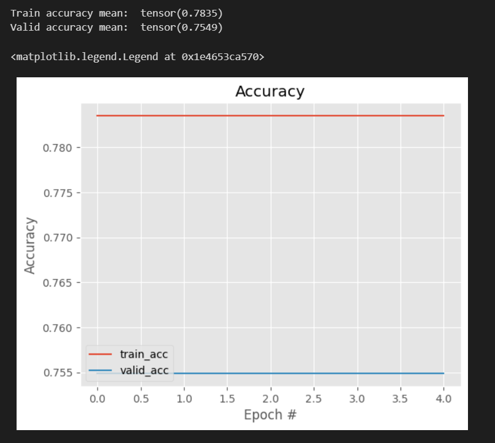

# 💪Skin Analysis ML Model

## 🌐Features
**Skin Condition Detection**: Identifies common skin conditions, including acne, pigmentation, and pore quality.

**Skin Tone Analysis**: Assists in determining the appropriate foundation color by analyzing light, medium, and dark skin tones.

## 🔨Technologies Used
**ML Model**: PyTorch with a pretrained ResNet-50 architecture

## 🔥How It Works
**Model Architecture**
The model is built on a ResNet-50 architecture, a powerful deep convolutional neural network pre-trained on the ImageNet dataset. ResNet-50 is known for its ability to extract rich features from images due to its deep layers and residual connections.

## 👩‍💼Steps Involved
**Data Preparation** :
The dataset consists of images categorized into different skin conditions and tones.
Each image undergoes transformations such as resizing, cropping, flipping, rotation, and normalization. These augmentations improve the model's robustness and ability to generalize.

**Loading Pre-trained Model** :
A ResNet-50 model pre-trained on ImageNet is loaded. This model already has learned to detect various general features from images.
The pre-trained layers of ResNet-50 are frozen to retain these learned features.

**Customizing the Model** :
The final fully connected layer of ResNet-50, which originally classifies into 1000 classes, is replaced with a new fully connected layer that classifies into 8 skin condition categories.
The new layer architecture is as follows:

model.fc = torch.nn.Sequential(
    torch.nn.Linear(2048, 128),
    torch.nn.ReLU(),
    torch.nn.Linear(128, 8),
    torch.nn.Softmax(dim=1)
)

**Training** :

The new fully connected layer is trained on the skin condition dataset while the rest of the ResNet-50 model remains frozen.
The model is trained to minimize cross-entropy loss, which measures the difference between the predicted probabilities and the actual class labels.
Training involves forward propagation, loss calculation, backward propagation, and parameter updates for the new layer.

**Evaluation** :

The trained model is evaluated on a separate validation set to ensure it generalizes well to unseen data.
Metrics such as accuracy and loss are monitored and plotted to visualize the training progress.

**Prediction** :

The model can predict skin conditions and skin tone from new images. The input image is transformed similarly to the training data and passed through the model to get class probabilities.
The class with the highest probability is chosen as the predicted skin condition or tone.

